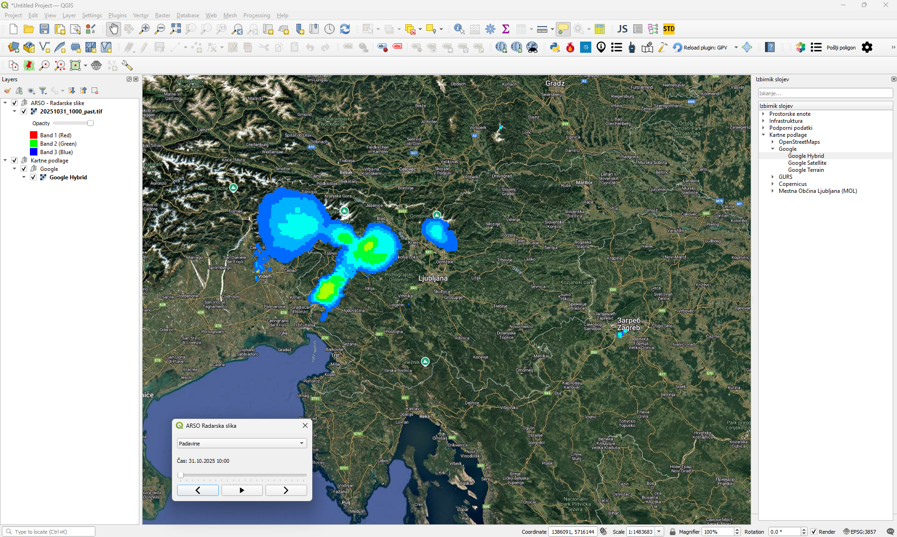
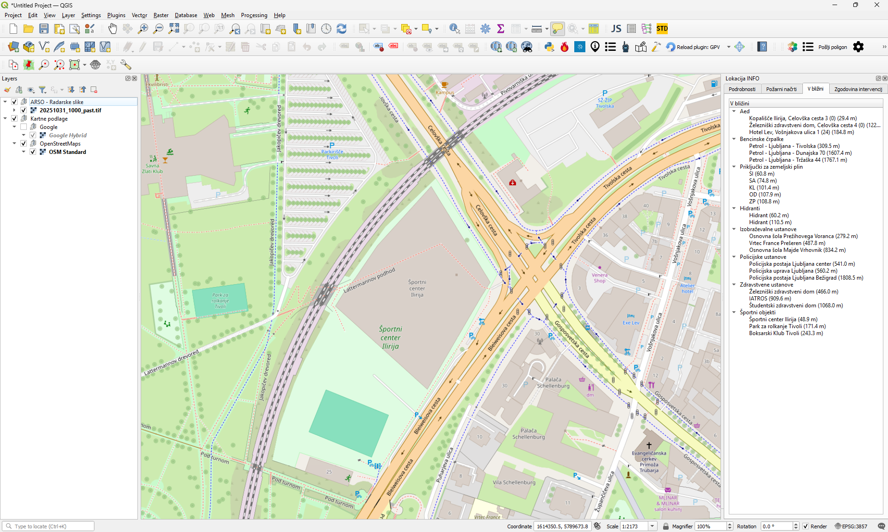
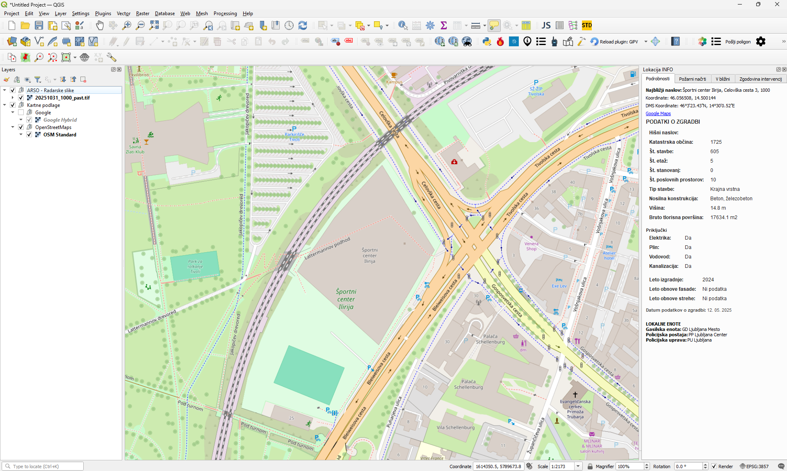
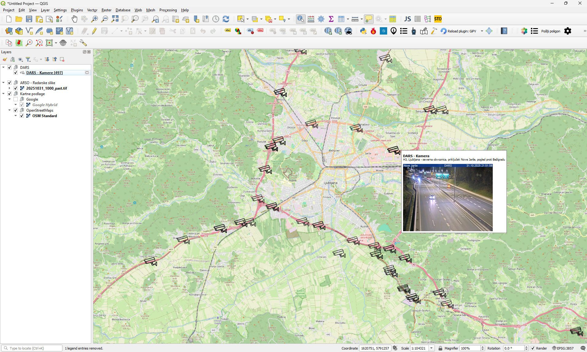

# SARIS - Search And Rescue Information System

**SARIS** is a powerful **QGIS plugin** designed for emergency responders and search & rescue operations. It combines live data, tactical planning, and critical infrastructure information into a single interactive map interface.

---

## Features Overview

| Module | Description |
|--------|-------------|
| **ARSO Radar Viewer** | Animated radar layers (rain, wind, temperature, etc.) with built-in animation player. |
| **Layer Selector (Izbirnik slojev)** | Access 40+ data layers and 20 map layers with one click. Includes roads, police/fire stations, hydrants, etc. |
| **Road Cameras** | View live traffic camera feeds on the map. |
| **Weather Stations** | Display real-time weather data for operational planning. |
| **Firefighter Locations & Vehicles** | Track teams, vehicles, and ongoing interventions in real time. |
| **Intervention Sectors** | Map and manage current and planned operation areas. |
| **Dispatch Radio Integration** | Connect to Motorola DMR system to view radio locations and telemetry in a dockable list. |
| **Drone Telemetry** | Integration with [Sokol](https://github.com/lbttim/Sokol) to display live drone data and flight paths. |
| **SITAC Editor (SITAC Urejevalnik)** | Draw tactical plans using CEN CWA 18017 standard graphics, optimized for fast operation. |
| **Location Info (Lokacija INFO)** | Right-click any location to view coordinates, address, building info, nearby resources, and emergency plans. |

---

## Highlights

- Real-time integration with multiple data sources.
- Interactive map with animated radar, drones, and telemetry layers.
- Quick tactical planning with SITAC editor.
- One-click access to critical infrastructure and emergency resources.
- Modular design for scalable emergency management.

---

## Screenshots

| ARSO Radar Viewer | Location Info - Building Info |
|------------------|-------------------------------|
|  |  |

| Location Info - Close Objects | Road Cameras |
|-------------------------------|---------------|
|  |  |

---

## Notes

- This repository is for **project presentation only**. Source code and installation instructions are not included.
- Designed for use within QGIS for professional emergency services.

---

## Contact

For more information or collaboration inquiries, please contact me.
